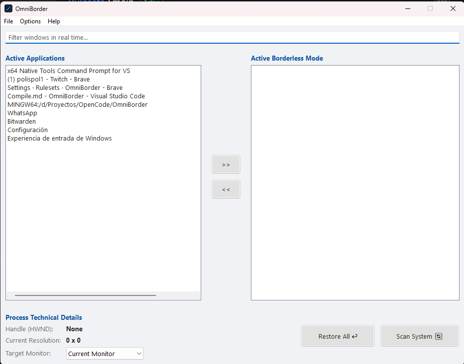

# OmniBorder

**Advanced Borderless Window Manager for Windows**

[](https://www.gnu.org/licenses/gpl-3.0)
[]()
[]()
[]()


---

### Support the Project

If **OmniBorder** has saved you time or made your gaming/work sessions better, please consider supporting its development! You can compile it yourself for free, but your support keeps this project alive and updated.

[](https://buymeacoffee.com/aesirsoft)

---

## Description

**OmniBorder** is a professional Windows utility designed for gamers and power users who demand seamless multi-monitor experiences. It forces external applications and games into true **Borderless Windowed Mode**, solving common pain points that native Windows settings fail to address.

### What Problems Does It Solve?

- **Focus Loss Prevention**: Games and applications lose focus when alt-tabbing or switching monitors. OmniBorder aggressively retains focus using advanced Win32 APIs.
- **Multi-Monitor Persistence**: Assign specific applications to dedicated monitors and remember their positions across sessions.
- **Rebel Taskbar Hiding**: Removes stubborn taskbar icons from Electron/Chromium-based applications (Discord, Chrome, VS Code) that ignore standard borderless modes.
- **Modern UI Stripping**: Uses DWM (Desktop Window Manager) to hide custom title bars and frames in modern UWP/XAML applications.
- **Native Dark Mode**: Full system-wide dark theme support with automatic detection and manual override.

Whether you're setting up a sim racing rig, a flight simulator cockpit, or simply want cleaner multi-monitor productivity, OmniBorder delivers professional-grade window management.

---

## Key Features

### Premium Capabilities

- **Smart Monitor Persistence**  
  Automatically remembers which monitor each application should occupy and restores it on launch.

- **Anti-Focus-Loss Mechanism**  
  Aggressive `SetActiveWindow()` and `SetForegroundWindow()` calls prevent Windows from stealing focus during borderless transitions.

- **DWM Modern Element Stripping**  
  Forces `DWMWA_NCRENDERING_POLICY` to disable custom title bars in Electron, UWP, and XAML applications.

- **Native Dark Mode**  
  Full immersive dark theme using `DWMWA_USE_IMMERSIVE_DARK_MODE` with manual toggle and config persistence.

- **System Tray Minimization**  
  Optional minimize-to-tray functionality with icon visibility control.

- **Auto-Save Configuration**  
  All settings, hotkeys, and application preferences persist in `config.ini` automatically.

- **Global Hotkeys**  
  Fully customizable system-wide hotkeys for instant borderless toggle and monitor switching.

- **Real-Time Window Filtering**  
  Search and filter active applications instantly with live preview.

---

## Building from Source

### Prerequisites

Before compiling OmniBorder, ensure you have the following installed:

| Requirement | Version | Notes |
|------------|---------|-------|
| **Operating System** | Windows 10/11 | Build 17763 or higher recommended |
| **Compiler** | MSVC 2019+ | C++17 compatible (Visual Studio 2019/2022) |
| **CMake** | 3.20+ | [Download CMake](https://cmake.org/download/) |
| **wxWidgets** | 3.2+ | [Download wxWidgets](https://www.wxwidgets.org/downloads/) |

### Step-by-Step Compilation

1. **Clone the repository:**
   ```bash
   git clone https://github.com/ndend-dev/OmniBorder.git
   cd OmniBorder
   ```

2. **Create build directory:**
   ```bash
   mkdir build
   cd build
   ```

3. **Configure with CMake:**
   ```bash
   cmake .. -G "Visual Studio 17 2022" -A x64
   ```
   
   > **Note:** Replace `"Visual Studio 17 2022"` with your installed version (e.g., `"Visual Studio 16 2019"`).

4. **Build the project:**
   ```bash
   cmake --build . --config Release
   ```

5. **Locate the executable:**
   ```
   build\bin\Release\OmniBorder.exe
   ```

---
### Preview




### Build Output Structure

```
OmniBorder/
├── src/              # Source files
├── languages/        # Translation files (es.ini, en.ini)
├── build/            # Build directory (generated)
│   └── bin/
│       └── OmniBorder.exe
├── CMakeLists.txt    # Build configuration
└── README.md         # This file
```

---

## Steam & Support

### Official Steam Release

While OmniBorder is **open-source and free to compile**, we offer an **official pre-compiled version on Steam** for users who prefer:

- **One-Click Installation** - No compilation required
- **Automatic Updates** - Stay current with seamless updates
- **Steam Cloud Sync** - Backup your configuration
- **Community Hub** - Share setups and configurations
- **Direct Developer Support** - Fund ongoing development

**Get OmniBorder on Steam** *(Coming Soon)*

---

## Contributing

We welcome contributions from the community. Whether it's bug fixes, new features, or documentation improvements, your help is appreciated.

### How to Contribute

1. **Fork the repository**
2. **Create a feature branch:** `git checkout -b feature/AmazingFeature`
3. **Commit your changes:** `git commit -m 'Add AmazingFeature'`
4. **Push to the branch:** `git push origin feature/AmazingFeature`
5. **Open a Pull Request**

### Contribution Agreement

By submitting a Pull Request, you agree that:

- Your contribution will be licensed under the **GPL v3** license.
- Your code may be integrated into **both the open-source version and the commercial Steam version**.
- You have the right to submit this code and it does not violate any third-party copyrights.
- You understand that accepted contributions become part of the project's codebase.

### Development Guidelines

- Follow existing C++17 coding standards
- Keep methods and comments in **English** for international compatibility
- Test your changes on Windows 10/11
- Update documentation if adding new features

---

### Language Support / Soporte de Idiomas
- English: Full support for the interface, documentation, and issues.
- Español: Soporte completo para la interfaz, documentación y solución de problemas.

## License

This project is licensed under the **GNU General Public License v3 (GPL v3)** - see the [LICENSE](LICENSE) file for details.

### What This Means for You

#### You CAN:

- Use OmniBorder **freely for personal use**
- Modify the source code for your own needs
- Distribute **unmodified** copies of the original software
- Learn from the code and use patterns in your projects

#### You MUST:

- Keep the project **open-source** if you distribute modified versions
- Release any **derivative works** under the **same GPL v3 license**
- Provide **source code access** to anyone who receives your modified version
- Clearly state **changes made** to the original code

#### You CANNOT:

- **Close the source** of modified versions and sell them commercially
- Incorporate this code into **proprietary/closed-source software**
- Remove copyright notices or license information
- Hold the developers liable for damages

### Why GPL v3?

The GPL v3 license ensures that OmniBorder remains **free and open** forever. It prevents companies from:

1. Taking the code, modifying it, and selling it as closed-source software
2. Benefiting from community contributions without giving back
3. Creating proprietary forks that fragment the user base

This protects both the **community** and the **original developers** while ensuring the software remains accessible to everyone.

---

## Contact & Support

- **Steam Store:** [OmniBorder on Steam](#)
- **GitHub Issues:** [Report Bugs & Feature Requests](https://github.com/ndend-dev/OmniBorder/issues)

---

## Acknowledgments

- Built with **C++17** and **wxWidgets**
- Special thanks to the **open-source community** for continuous support
- Powered by **Windows Desktop Window Manager (DWM)** APIs

---

**Made for the gaming and productivity community**

*OmniBorder - Where Performance Meets Elegance*